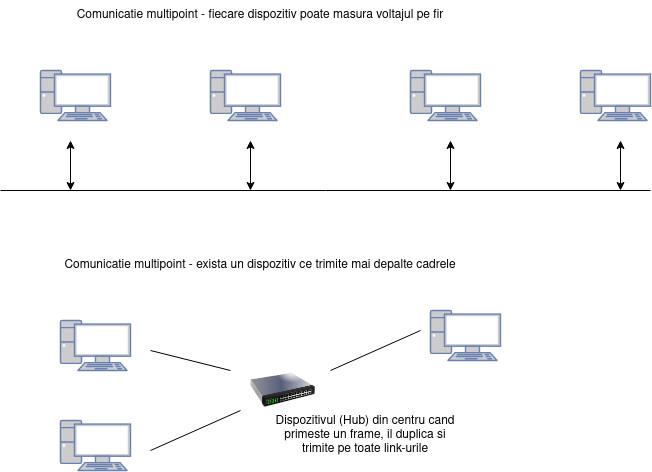

# Point-to-Multipoint

Intr-o transmisie de tip Point-to-Multipoint, avem un transmitator si mai multi receptori. Cel mai popular mod de a identifica destinatia este de a **include un camp de identificare in antetul protocolului** (e.g. adresa MAC in Ethernet). In imaginea de mai jos sunt doua exemple de comunicari multipoint.

