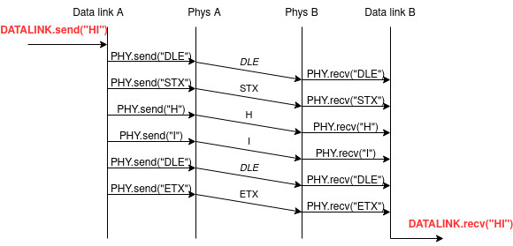

# Character stuffing în practică

Cum in software ne este mult mai ușor sa lucram la nivel de byte decât bit,
nivelul fizic ne oferă și un serviciu de trimitere de fluxuri de bytes. În mod
similar cu bit stuffing, vom folosi mai multe caractere speciale pentru a ne
delimita frame-ul. Vom folosi `DLE`, `STX` si `ETX` definiti in [tabela
ASCII](https://www.rapidtables.com/code/text/ascii-table.html)

`A B C => DLE STX A B C DLE ETX`

`A B C DLE STX D => DLE STX A B C DLE DLE STX D DLE ETX`

Mai jos avem o diagrama care surprinde transmisia de date folosind
framing. Vedem cum la nivelul DataLink folosind protocolul nostru simplu
cu bytes de separare putem oferi un serviciu de trimitere de frames.



Observam ca serviciul pus la dispozitie de nivelul Data Link catre nivele
superioare permite transferul direct de siruri de caractere.

Următorul exemplu prezintă o posibila implementare de character stuffing
folosind `DEL`,`STX` si `ETX`. Presupunem că am cumpărat o placa de
rețea (NIC) care are în firmware doua funcții `send_byte` si
`recv_byte`. In general, implementarea unui protocol se face intr-o biblioteca
pe care atat programul ce ruleaza la transmitator cat si cel de la receptor
o folosesc.

Transmiterea este relativ simpla.

``` C
/* Transmitem date aflae in buffer */
/* Trimite delimitator */
send_byte(DLE);
send_byte(STX);

/* Trimite bytes din frame */
for (int i = 0; i < size; i++) {
  /* Facem escape la escape */
  if (buffer[i] == DLE)
    send_byte(DLE);
    
  send_byte(buffer[i]);
}

/* Trimite delimitator final */
send_byte(DLE);
send_byte(ETX);
```

Receptia cadrului are o complexitate mai mare, deoarce in exemplul nostru
`recv_byte` intoarce date aleatoare cand transmitatorul nu trimite nimic.

``` C
char c1, c2;

c1 = recv_byte();
c2 = recv_byte();

/* Cat timp nu am primit DLE STX citim bytes. Atentie la modul in care salvam
 * byte-ul precedent. */
while((c1 != DLE) && (c2 != STX)) {
  c1 = c2;
  c2 = recv_byte();
}

/* Am primit inceputul unui frame: DLE STX */
for (int i = 0; i < max_size; i++) {
	char byte = recv_byte();

  /* Daca am primit un escape */
	if (byte == DLE) {
	  byte = recv_byte();
	  
	  /* Am primit DLE ETX */
	  if (byte == ETX)
	    return i;

	  /* Dupa DLE, trebuie sa primim alt DLE,
	     altfel frame-ul nu este bine structurat */ 
	  else if (byte != DLE)
	    return -1;
	}

	/* Punem in buffer continutul frame-ului */    
	buffer[i] = byte; 
}
```

