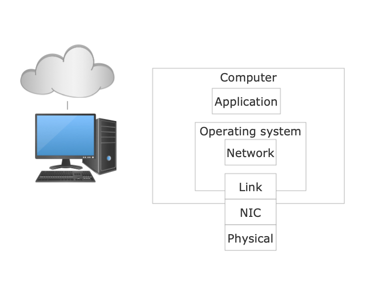

## Unde se intampla transmisia?

 Legătura de Date si Retea sunt procese
independente ce comunica prin schimburi de mesaje. Procesele ce țin de
nivelul Fizic și de sub-layerul Media Access Control din Data Link
rulează pe hardware dedicat (de exemplu, Network Interface Card (NIC)).
Restul proceselor executate de Data Link și de Network se executa pe
CPU, prin sistemul de operare. În figură, putem observa o implementare.